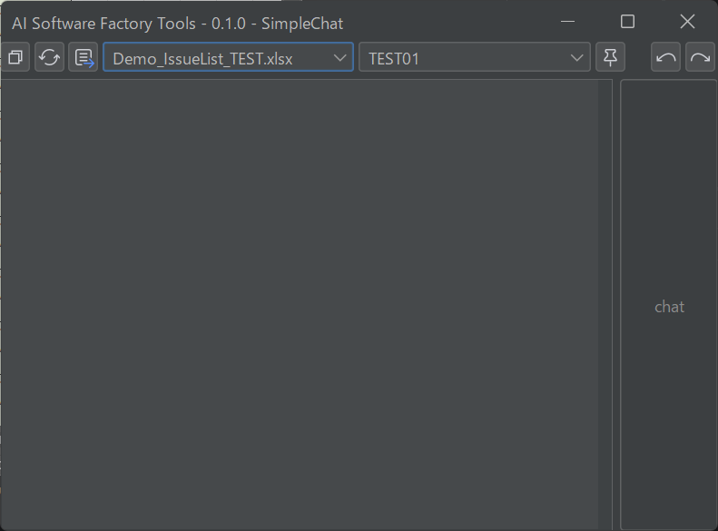

# LLMtools - ForSpreadsheets

[](https://www.gnu.org/licenses/old-licenses/gpl-2.0.html) [](https://openjdk.org/projects/jdk/17/) [](https://kotlinlang.org/) [](https://spring.io/projects/spring-boot) [](https://spring.io/projects/spring-ai)

LLM（大規模言語モデル）を活用して、Excel ドキュメントをインタラクティブに操作・検索するためのデスクトップツールです。  
OpenAI API 互換のエンドポイントに接続し、スプレッドシートとの対話的な操作を実現します。

---

## Index

- [動作環境](#動作環境)
- [クイックスタート](#クイックスタート)
  - [アプリケーションの起動](#アプリケーションの起動)
  - [GUI の操作方法](#gui-の操作方法)
  - [使い方の例：表の空欄を自動入力する](#使い方の例表の空欄を自動入力する)
- [設定](#設定)
- [開発者向けガイド](#開発者向けガイド)
  - [開発環境の構築](#開発環境の構築)
  - [設定ファイルの編集](#設定ファイルの編集)
  - [IntelliJ IDEA でのビルド・デバッグ実行](#intellij-idea-でのビルドデバッグ実行)
  - [単体実行可能パッケージの作成](#単体実行可能パッケージの作成)
- [コントリビュート](#コントリビュート)
- [ライセンス](#ライセンス)

---

## 動作環境

| 項目 | バージョン |
| ---- | ---------- |
| OS | Windows 10 / 11 |
| Java | 17 以上 |
| Git | リポジトリのクローンに必要 |
| Excel | Microsoft Excel（PowerShell 経由で操作） |
| OpenAI API | OpenAI API 互換エンドポイント |

---

## クイックスタート

> **前提**: Java 17・Git・OpenAI API キー・Microsoft Excel が必要です。

### アプリケーションの起動

1. **リポジトリをクローン**します。

   ```commandline
   git clone https://github.com/<your-org>/LLMtools-ForSpreadSheets.git
   cd LLMtools-ForSpreadSheets
   ```

2. **`launcher/application.properties` を設定**します（[設定](#設定) を参照）。

3. **JRE を準備**します（[_doc/SETUP.md](_doc/SETUP.md) の「4. JRE を配置する」を参照）。

4. **`gradlew genExe` を実行**してビルドします。JAR ファイルの生成も含めてすべて自動で行われます。

   ```commandline
   gradlew genExe
   ```

   ビルドが成功すると `exe/` フォルダにパッケージ一式が生成されます。

5. **`exe\LLMtoolsForSpreadsheets.bat` をダブルクリック**してアプリケーションを起動します。

起動すると、以下のようなチャットウィンドウが表示されます。



### GUI の操作方法

ウィンドウ上部のツールバーには左から順に以下のコントロールが並んでいます。

| コントロール | 説明 |
| ------------ | ---- |
| **常前面ボタン** | ウィンドウを常に最前面に表示するかどうかを切り替えます。有効にすると Excel 操作中もチャットウィンドウが隠れません。 |
| **↺（リフレッシュ）ボタン** | 現在開いている Excel ファイルの一覧を再取得し、ワークブックセレクタの内容を更新します。Excel でファイルを開いた後に押してください。 |
| **取り込みボタン** | 現在最前面のワークブックおよびシートを操作対象として選択し、自動でピン止めします。Excel で作業中のシートをすばやく対象に設定できます。 |
| **ワークブックセレクタ** | 操作対象の Excel ワークブックを選択します。選択するとそのワークブックがアクティブウィンドウになります。 |
| **シートセレクタ** | 操作対象のシートを選択します。ワークブックを選択するとそのシート一覧が表示されます。選択するとそのシートがアクティブになります。 |
| **ピン止めボタン** | ワークブックおよびシートの変更を固定します。有効にするとセレクタが無効化され、誤操作による対象変更を防げます。 |
| **↩（アンドゥ）ボタン** | 選択範囲をプロンプト実行前の状態に戻します。chat 実行後に内容を元に戻したい場合に使用します。 |
| **↪（リドゥ）ボタン** | 選択範囲をプロンプト実行後の状態に戻します。アンドゥした内容をやり直す場合に使用します。 |
| **チャット入力欄** | LLM への指示を自由に入力します。Excel を開いているときのみ入力が有効になります。 |
| **chat ボタン** | 入力した指示と選択範囲のデータを LLM に送信し、処理結果を選択範囲に書き戻します。 |

**基本的な操作の流れ:**

1. Microsoft Excel でファイルを開く。
2. **↺ ボタン**を押してワークブック一覧を更新し、ワークブックセレクタ・シートセレクタで対象を選択する。
3. Excel 上で操作したいセル範囲を選択する。
4. チャット入力欄に指示を入力し、**chat** ボタンをクリックする。
5. LLM が指示を解釈し、選択範囲のデータを自動的に操作・修正する。
6. 結果を確認し、意図と異なる場合は **↩ アンドゥボタン**で元の状態に戻す。

### 使い方の例：表の空欄を自動入力する

関連データが入力済みの表を選択し、空欄だけを LLM に補完させることができます。

**手順:**

1. Excel で、空欄を含むデータ表のセル範囲を選択する。
2. チャット入力欄に以下のように入力して **chat** ボタンを押す。

   ```
   空欄に適切な値を埋めてください。
   ```

3. LLM が既存データの文脈を読み取り、空欄に適切な値を自動で埋める。

**活用シーン:**

- ユースケース一覧表の「ユースケース名（英語）」欄の自動補完
- 商品マスタの「カテゴリ」や「説明」欄の一括生成
- 英語表記・略称など、パターンを持つ列の自動入力
- ドキュメントの欠損値補完

---

## 設定

`application.properties` は以下の 2 箇所に存在します。設定内容は両方に反映してください。

| ファイル | 用途 |
| -------- | ---- |
| `launcher/application.properties` | 単体実行パッケージ起動時に使用 |
| `src/main/resources/application.properties` | 開発・デバッグ時に使用 |

### OpenAI API 設定

```properties
# OpenAI API Configuration
spring.ai.openai.base-url=https://api.openai.com/v1  # Base URL
spring.ai.openai.api-key=                            # API キー
spring.ai.openai.chat.options.model=gpt-4o           # 使用するOpenAIのモデル名
spring.ai.openai.chat.options.temperature=0.7        # 生成温度 (0.0〜1.0)
```

### プロキシ設定（必要な場合のみ）

```properties
# Proxy Configuration
proxy.enabled=false        # プロキシを使用する場合は true
proxy.host=                # プロキシホスト名
proxy.port=                # プロキシポート番号
proxy.username=            # 認証ユーザー名
proxy.password=            # 認証パスワード
```

---

## 開発者向けガイド

### 開発環境の構築

詳細な開発環境の構築手順は [_doc/SETUP.md](_doc/SETUP.md) を参照してください。

### 設定ファイルの編集

開発時は `src/main/resources/application.properties` を編集します（[設定](#設定) を参照）。

### IntelliJ IDEA でのビルド・デバッグ実行

本プロジェクトは IntelliJ IDEA、Eclipse、Visual Studio Code 等の IDE でビルド・実行できます。  
以下は IntelliJ IDEA を使用した手順です。

#### ビルド

1. IntelliJ IDEA でプロジェクトを開く。
2. **[メインメニュー] → [ビルド] → [プロジェクトをビルド]** を選択します。

#### デバッグ実行

初回のみ、以下の手順で実行構成を作成します。

1. **[メインメニュー] → [実行] → [実行構成の編集]** を選択します。
2. **[+] → [Spring Boot]** を選択し、実行/デバッグ構成を追加します。
3. 以下の項目を入力し、**[適用]** を押下します。

   | 項目 | 値 |
   | ---- | -- |
   | 名前 | LLMtoolsForSpreadsheets |
   | 実行場所 | ローカルマシーン |
   | Java | 17（`-cp` 選択時に自動設定） |
   | `-cp` | `LLMToolsForSpreadsheets.main` |
   | メインクラス | `moros.asf.tools.forspreadsheets.LLMToolsForSpreadsheetsJavaEditionKt` |
   | 有効なプロファイル | `LLMToolbox` |

4. **[メインメニュー] → [実行] → [実行]** から `LLMtools - ForSpreadsheets` を選択して起動します。

### 単体実行可能パッケージの作成

#### ビルド

ビルドが成功すると `exe/` フォルダ配下に実行パッケージ一式が生成されます。

1. JRE 環境を zip 化したものを `launcher/` に配置します（[_doc/SETUP.md](_doc/SETUP.md) の **[構築手順] - [3. JRE を配置する]** を参照）。
2. 以下のコマンドを実行します。

```commandline
gradlew genExe
```

#### 実行

`exe/LLMtoolsForSpreadsheets.bat` をダブルクリックするとアプリケーションが起動します。

---

## ライセンス

本プロジェクトは [GNU General Public License v2.0](LICENSE) のもとで公開されています。
